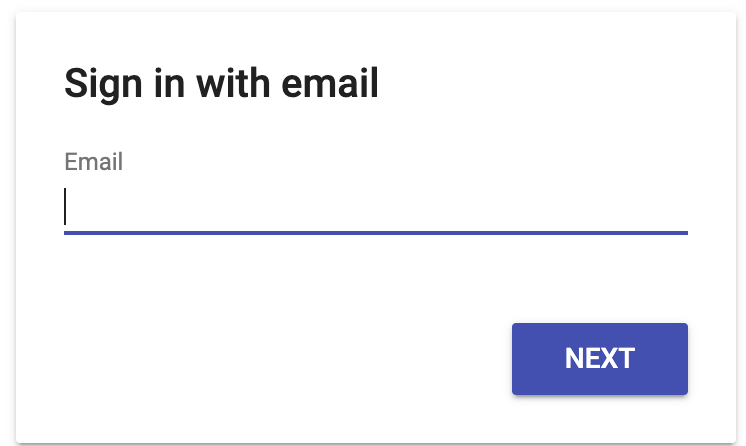

# Proof of concept: easy Chrome extension authentication with Firebase

I built this proof of concept while trying to build an auth system that would work seamlessly for [Parakeet](https://github.com/uyhcire/parakeet/).

To the best of my knowledge, this is the only Chrome extension auth system that supports the following:

- Log in to Firebase using any Firebase-supported provider
- Automatically share the credentials with all of the extension's content scripts

We do this by pushing "custom auth tokens" from one part of the extension to the other, as was suggested [here](https://github.com/firebase/quickstart-js/issues/208#issuecomment-619418465) by [@julienR2](https://github.com/julienR2). The custom auth tokens are generated server-side by a Firebase Cloud Function.

The main downside is that the content scripts' auth sessions can last far longer than you have configured in Firebase, but for certain applications this may not be a big deal.

Also, signing out is not really supported, though this should not be difficult to implement.

# Setup

The setup is a bit involved, as you'll need to create and set up a Firebase project.

At a high level, this is what you'll need to do:

- Create a Firebase project and install the Firebase CLI
- Set up the repo as a Firebase project
  - Make sure `.firebaserc` exists in the repo root directory
  - Obtain your `firebaseConfig` object and create `extension/config.js` with `export const firebaseConfig = ...`
- Deploy to your Firebase project from the root directory of this repo
- Enable the email-password sign-in provider in Firebase
- Give the Cloud Function permission to generate custom auth tokens. If you run into trouble, you can take a look at Firebase's [troubleshooting guide](https://firebase.google.com/docs/auth/admin/create-custom-tokens#troubleshooting).
  - Enable the IAM API [here](https://console.cloud.google.com/apis/library/iamcredentials.googleapis.com)
  - Go to IAM in the Google Cloud console and grant the "Service Account Token Creator" role to `{project-name}@appspot.gserviceaccount.com`
  - Wait a few minutes for the new role to be usable by your Cloud Function. If you try to run your Cloud Function immediately, you might see an error.
- Build the extension and install it via `Load unpacked`
